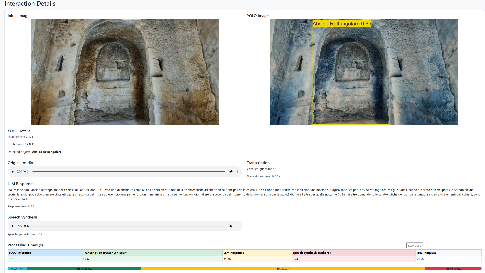
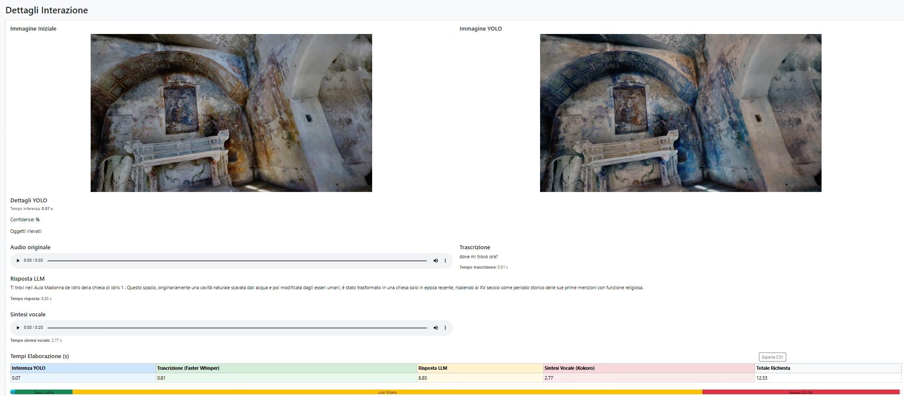

# Design and Evaluation of an LLM-Powered Virtual Guide for Rupestrian Churches Using XR Technologies
LLM-powered virtual guide for rupestrian churches in Matera. The system combines speech transcription, visual object detection, spatial contextualization, and RAG to deliver context-aware responses grounded in curated cultural heritage knowledge. Beyond system implementation, the system serves as a controlled experimental platform for investigating the causal impact of retrieval augmentation on response quality, grounding fidelity, robustness, and stability. To isolate this effect, a paired RAG ON/OFF design was adopted across multiple large-scale language models (70B–120B parameters), enabling within-query comparisons under identical prompting and decoding conditions. Evaluation was conducted using a hybrid methodology that integrates automated retrieval-aware metrics (RAGAS) with a blind expert assessment involving domain specialists in medieval archaeology.

## XR Application Videos
This section presents demonstration videos of the proposed application, illustrating how users interact with the system in an immersive XR environment.

*Demonstration of user interaction and real-time contextual responses within the rupestrian environment of San Falcione.*

*Demonstration of user interaction and real-time contextual responses within the rupestrian environment of Santa Maria de Idris.*

*Demonstration of user interaction and real-time contextual responses within the rupestrian environment of Santa Barbara.*

## Interaction Dashboards
This section showcases the complete multimodal processing pipeline for a single user query across three rupestrian churches: San Falcione, Santa Maria de Idris, and Santa Barbara.

*Backend interaction dashboard of San Falcione.*

*Backend interaction dashboard of Santa Maria de Idris.*

*Backend interaction dashboard of Santa Barbara.*
